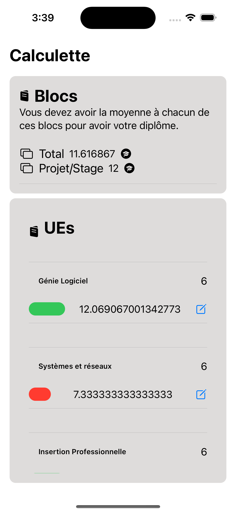
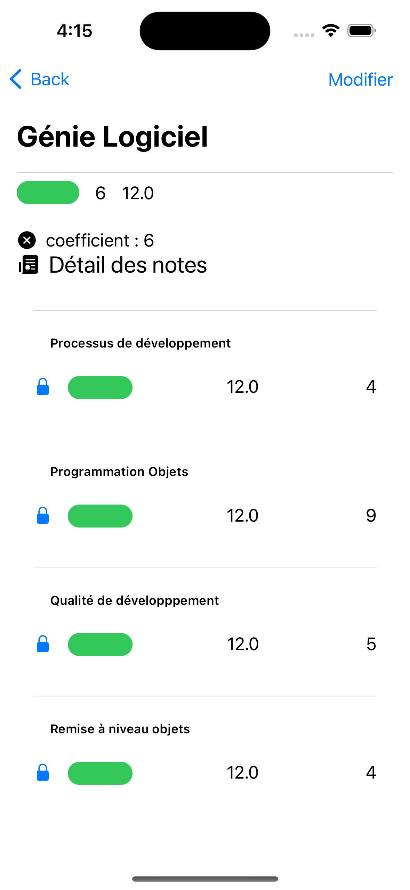
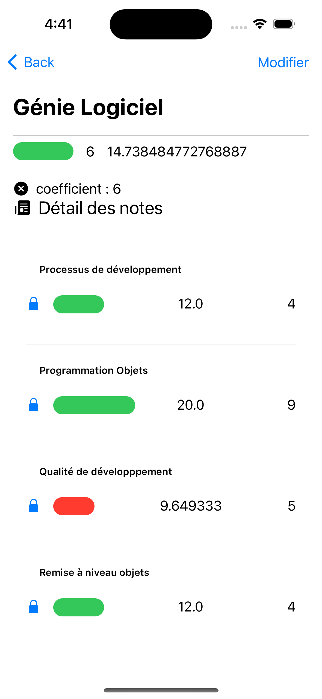
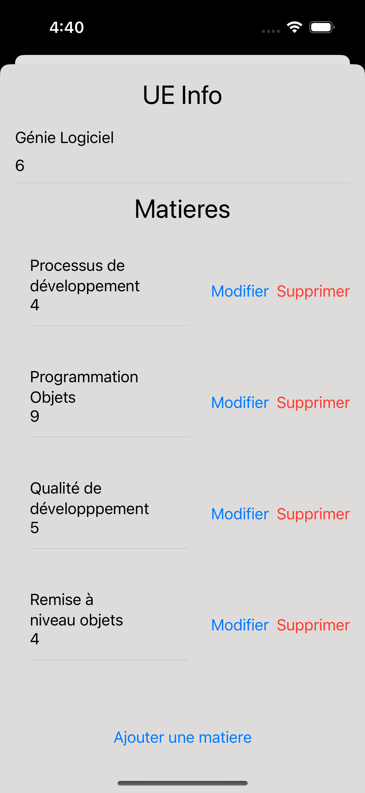
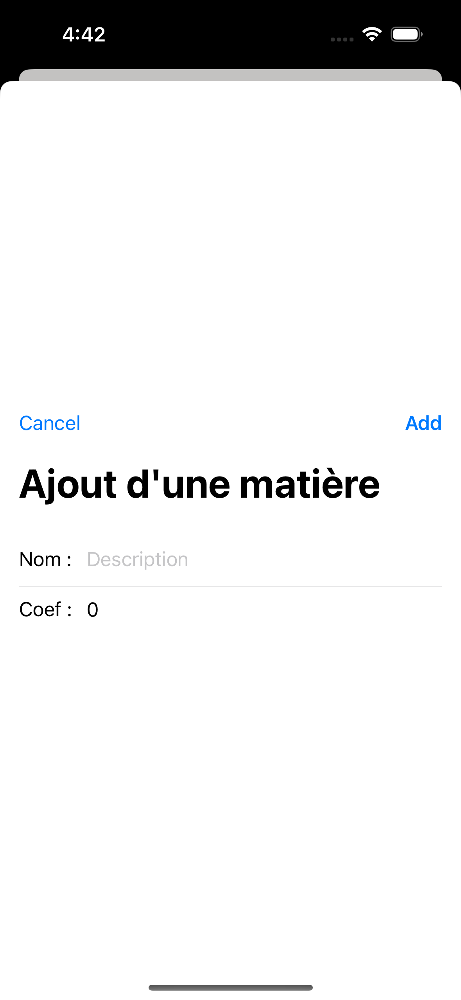

[](https://codefirst.ddns.net/augustin.affognon/MaCalculette)  

# MaCalculette

Welcome on the MaCalculette project!  

   
 
## iOS Screenshots
  Accueil                 |   Page Detail UE       |  Page UE (2)                    |Sheet Modification (Modifier)                 
:-------------------------:|:-------------------------:|:-------------------------:|:-------------------------:
   |  |   |   


  Ajout Matière à l'UE                 |    DEMO               
:-------------------------:|:-------------------------:
   | <a href="Documentation/doc_images/videooo.mp4">Regardez un demo</a>  <video controls="" src="Documentation/doc_images/videooo.mp4?raw=true"></video>  
## Directory Structure
```
source
│  
└───Note
    │───Manager
    |    └──DataManager.swift
    │───model
    │    │──Matiere
    |    │──Ue
    |    └──Bloc
    │───View
    |    │──Home
    |    │──UePage
    |    │──
    |    └──
    │───ViewModel
    |    │──MatiereVM
    |    |__UeVM
    |    |__BlocVM
    |    └──DataManagerVM
    |       
    │───DataStub
    |    └──DataStub
    └───Assets
         └──NoteColor
```